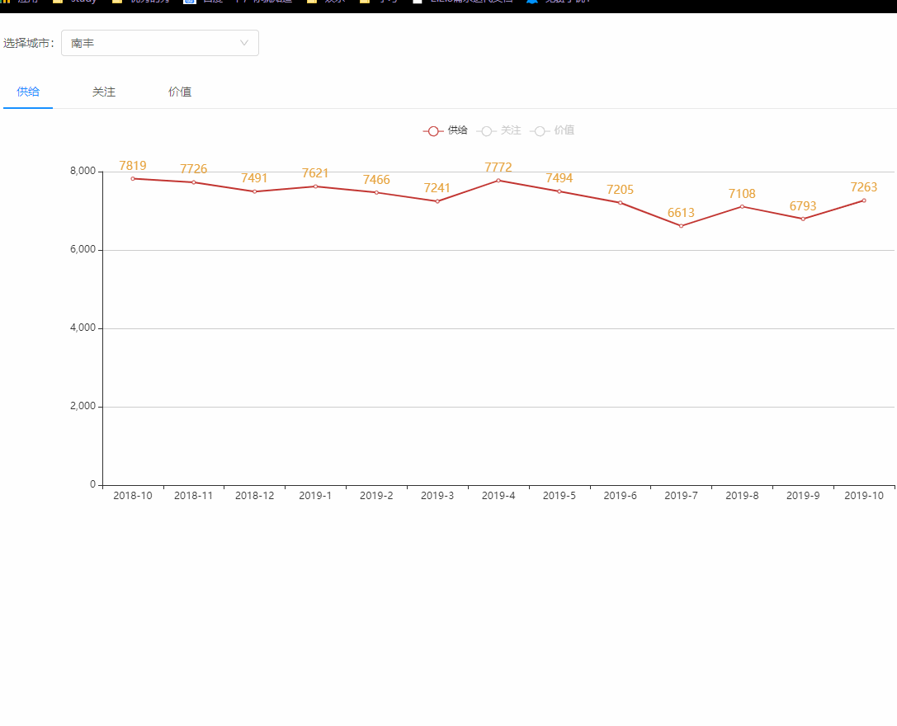
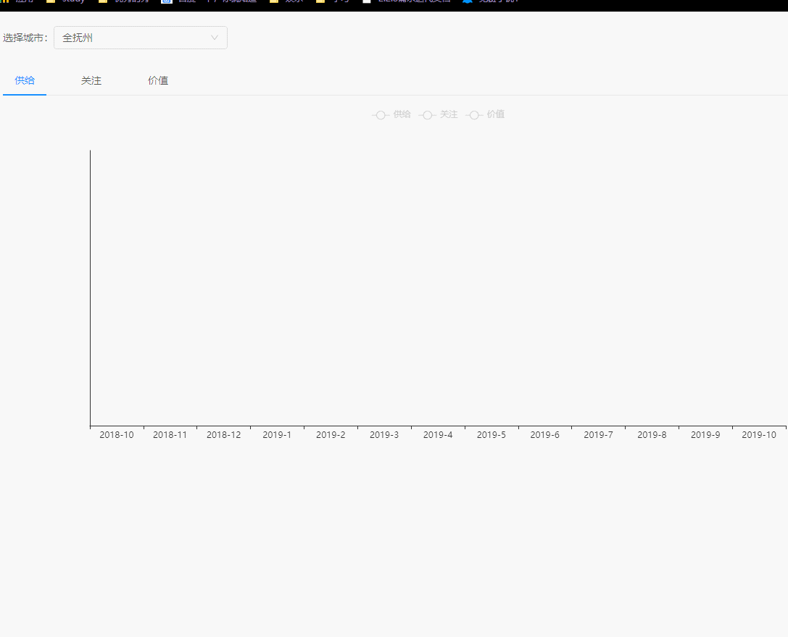

## 1.项目大概说明
> 想买房却不知道价格怎么办？想这道最近一年最近两年你城市的房价是多少吗？想了解你周边城市的房价是多少吗？想知道什么时候入手最合适吗？房价到底是涨还是跌？对不起，在我这里这些问题根本不存在。因为我根本就不知道！好吧，那么就运用点技术手段来分析分析你所在城市的房价到底是在涨还是在跌！项目仅供参考，房价涨了还是跌了，都得你来负责(🤭）。
## 2.项目技术情况
- 数据来源
- 数据可视化： Vue+Echarts
### 2.1数据来源
房价来源接口群来自[中国房价行情](http://www.creprice.cn/),就目前来看，这个网站提供得数据相对来说还是比较可靠的。并且涵盖的维度比较广，全国各地 上到省下至县基本都有统计(排除少部分县城太小，房价数据不公开，且数据量太小无法统计，我家那小县城就没得数据~)。
- API: http://www.creprice.cn//market/chartsdatanew.html 
- 字段解释

从首页挑选城市进入比如: (抚州市) -> 跳转：http://www.creprice.cn/district/CR.html?city=fuzhou 固定字段：
~~~
 const defaultParam = {
        city: 'fuzhou', //城市 页面头部的query参数 ?city=fuzhou 
        proptype: 11, //默认未知
        sinceyear: 1, // 最近几年？ 1 3均可
        flag: 1, //默认
        isv3: 0, //默认
        type: 'forsale', //默认
        matchrand: 'a0b92382',//默认
        based: 'price', //默认
        dtype: 'line' //折线图
 }

 const options = {
    district: 'CR' //县的缩写
    town: '' //镇的缩写
    sinceyear: 1 最近年
 }

 //调用接口时一定要在webpack里配置域名转发，防止跨域问题
 module.exports = {
    devServer: {
        port: 9100, //端口号
        proxy: {
            '/market': {
                target: ' http://www.creprice.cn', //转发的前缀
                changeOrigin: true
            },

        }
    }
}
~~~

### 2.2数据可视化
主要是用Echart图表，展现房价趋势。一共有三种折线图： 供给、关注、价值。解释：供给简单解释就是市场价。关注：购房者愿意出的价钱。价值：该房子的实际价值。（可以看出基本上实际价值与供给价有很大的出路，也就是说这房价根本不合理啊，大兄弟）

## 3.如何运行？
- 1.git clone https://github.com/xiuxiumomo/vue-rearn.git
- 2.yarn or npm install
- 3.yarn or npm run serve
- 4.说明: 该项目接口只适用于devlopment阶段调试用，npm run build 打包后是不能用的。或者你可以选择用node等技术做转发，发布到自己的服务器上使用。

## 4.后记
生命诚可贵，房子价更高，若为自由故，那还是别买了。🤭

